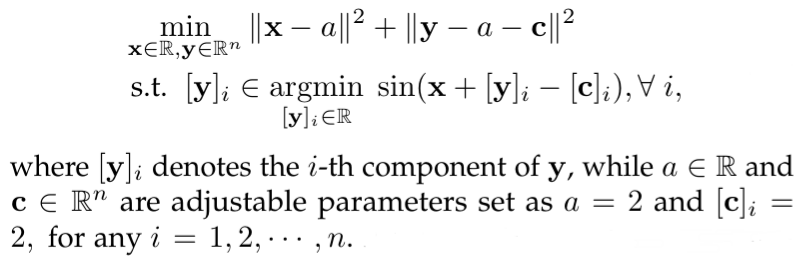

# Value-Function-based Sequential Minimization for Bi-level Optimization
this is the official code for the paper "Value-Function-based Sequential Minimization for Bi-level Optimization"

## Environment Preparing
```
python 3.6
pytorch 1.6
```

### Training

We provide examples for optimistic BLO.<br>

<div align=center>
  

</div>

You can adjust the algorithm through parameter setting. We will give the default setting in the following example.
The results will be saved in `./result_{time.strftime("%Y_%m_%d_%H_%M_%S")}.csv`
```
python optimistic.py
--size 2         #Lower level problem dimension
--z_loop 50
--y_loop 25
--x_loop 500
--z_lr 0.01
--y_lr 0.01
--x_lr 0.01
--z_L2_reg 0.01  #\mu
--y_L2_reg 0.01  #\theta
--y_ln_reg 0.001 #\sigma^(1)
--x0 0.
--y0 0.
  ```
  
  In addition, you can also manually change the lower objective *f* ``def lf(x,y)`` and upper objective *F* ``def uF(x,y)`` in the code to test the functions you need
```
def lf(x, y):
    out = 0
    for i in range(tSize):
        out = out + torch.sin((x + y[i] - C[i]))

    return out


def uF(x, y):
    return torch.norm(x - a) ** 2 + torch.norm(y - a - C) ** 2

```
  
  
  
### Reference

If you find our work useful in your research please consider citing our paper:

```
@misc{liu2021valuefunctionbased,
      title={Value-Function-based Sequential Minimization for Bi-level Optimization}, 
      author={Risheng Liu and Xuan Liu and Shangzhi Zeng and Jin Zhang and Yixuan Zhang},
      year={2021},
      eprint={2110.04974},
      archivePrefix={arXiv},
      primaryClass={cs.LG}
}
```
